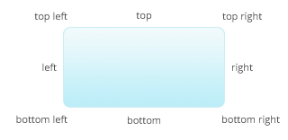

documentation
=============

To programmatically instantiate an Opentip you use this syntax:


new Opentip("#my-element", "Optional content", "Optional title", { ...options... })


The `content` and `title` are optional but it doesn't make much sense to omit
the `content` unless the content gets downloaded with **AJAX**.

Alternatively you can use html attributes to create opentips:

### html attributes

When the document is loaded Opentip scans the document and finds all elements
with a `data-ot` attribute, and instantiates an Opentip automatically. To
configure the Opentip this way simply add attributes beginning with `data-ot-`
and the *dashed* option name. Example:



Hover me



opentip object api
------------------

You can manage Opentips with a few methods after you created them.


var myOpentip = new Opentip($("#element"));

myOpentip.show(); // Shows the tooltip immediately
myOpentip.hide(); // Hides the tooltip immediately
myOpentip.prepareToShow(); // Shows the tooltip after the given delays. This could get interrupted
myOpentip.prepareToHide(); // ...

myOpentip.deactivate();
myOpentip.activate();

myOpentip.setContent("New content"); // Updates Opentips content


creating styles
---------------

Styles are a way to store predefined settings. So instead of setting the color,
and stemsize, etc... on every Opentip you create, you can just create **one**
style and reuse it in all of your Opentips.

You can define everything in a style that you could define in the opions object.
So if, for example, all your error tooltips should look like the built in `alert`
theme, should be fixed, have a stem and should be shown on creation you could
create the style like this:


Opentip.styles.myErrorStyle = {
  // Make it look like the alert style. If you omit this, it will default to "standard"
  extends: "alert",
  // Tells the tooltip to be fixed and be attached to the trigger, which is the default target
  target: true,
  stem: true,
  showOn: "creation"
};

// Then use it like this:
myTip = new Opentip("Content", { style: "myErrorStyle" });


> **Side note:** The `options` object you pass when creating an Opentip is actually just
> an ad hoc style created only for this one specific tooltip. The options `style`
> and `extends` are actually exactly the same. So you could theoratically create an
> Opentip like this: `new Opentip("Content", { extends: "myErrorStyle" });`
> although I feel that `style` is better suited in that case.

grouping opentips
-----------------

Sometimes you want to hide other Opentips when showing one.

For example: you could have a list of tags and when the user clicks one you show
some additional tag information. But you also want to hide all other tag informations
so to make sure that only one Tag-Opentip is visible at all times.

This is done through grouping:


<a href="/tag-info/tag/1" data-ot="Tag info 1" data-ot-group="tags" data-ot-ajax="true">Tag 1</a>
<a href="/tag-info/tag/2" data-ot="Tag info 2" data-ot-group="tags" data-ot-ajax="true">Tag 2</a>
<a href="/tag-info/tag/3" data-ot="Tag info 3" data-ot-group="tags" data-ot-ajax="true">Tag 3</a>


> **Note**: This example is not the best way to solve such problems. Look at the
> "Best practices" section below for a better way to handle it.

programmatically managing opentips
----------------------------------

One of the most common questions asked is how to hide Opentips or disable them.

Most problems arise because often Opentips are created with HTML `data-` attributes
although it makes more sense to create them programmatically.

Here's an example of how you would manage an Opentip in your application with
jQuery:


$(function() {
  // Start when document loaded
  var myInput = $("#my-input");
  var inputOpentip = new Opentip(myInput, { showOn: null, style: 'alert' });

  // Hide the tooltip on focus so we don't bother the user while editing.
  myInput.focus(function() { inputOpentip.hide(); });
  myInput.change(function() {
    if (myInput.val()) {
      // Everything fine
      inputOpentip.hide();
    }
    else {
      // Oh oh
      inputOpentip.setContent("Please fill out this field.");
      inputOpentip.show();
    }
  });

});


If for some reason you can't or don't want to create Opentips programmatically
but still want to access them, there's good news! You can.

Every Opentip created is stored on the element itself in an `opentips` array.
To access it, you can use the functions provided by your framework to access
arbitrary data of HTML elements.


  // jQuery
  $("#my-element").data("opentips"); // Returns a list of Opentips associated with this element
  // Prototype
  $("my-element").retrieve("opentips");
  // Ender
  $("#my-element").data("opentips");


### show / hide all opentips

Sometimes you just want to show or hide all Opentips on the page. To do so,
Opentip keeps a list for you: `Opentip.tips`.

So, to hide all tips, just do:


  for(var i = 0; i < Opentip.tips; i ++) { Opentip.tips[i].hide(); }


best practices
--------------

You should avoid abusing the HTML configuration. If you mainly have a static
HTML site and you want to add Opentips here and there, it's fine (but even then,
try not to put to much configuration in the HTML attributes, but rather create
a new style that you can use – especially if you notice that your configuration
is repeated a lot).

As soon as you need interaction with your Opentips, it's probably a good idea
to create them programmatically. The same goes for many Opentips that need to
be created and would result in lots of repeating HTML code.

Let's say you have a list of tags, and you want to show iformation about them
when clicked. The best way to approach that would be to create the HTML elements
without a notion about Opentips like this:



  <a href="/tag-info/1" class="tag">Tag 1</a>
  <a href="/tag-info/2" class="tag">Tag 2</a>
  <a href="/tag-info/3" class="tag">Tag 3</a>
  etc...



To attach the Opentips then, you would do so like that in JS (with jQuery):


// Create a style for all tag Opentips
Opentip.syles.tag = {
  ajax: true, // The URL to download will be taken from the href attribute
  showOn: 'click', // this will disable the default <a /> link behaviour.
  target: true, // Takes the <a /> element as target
  tipJoint: "bottom", // So the tooltip floats above the link
  group: "tags" // Ensures that only one tag Opentip is visible
};

// Now create an Opentip for each tag element
$("#tags a.tag").each(function(tagElement) {
  new Opentip(tagElement, { style: "tag" });
});


* * *

options
-------

### Glossary

- `JOINT`  
  Defines a position inside an Opentip. This is a case insensitive
  string with a horizontal position (`left`, `center`, `right`) and a vertical
  position (`top`, `middle`, `bottom`) in any order where `center` and `middle`
  can be omited.

  

- `OFFSET`  
  An array with `x` and `y` position as contents.

  Example: `[ 100, 50 ]`

* * *

Option                      | Type                                                       | Default                | Comment
----------------------------|------------------------------------------------------------|------------------------|--------------------------------------------------------------------------------
`title`                     | String                                                     |                        | You can pass the title in the constructor, or as option
`escapeTitle`               | Boolean                                                    | `true`                 | Whether the provided title should be html escaped
`escapeContent`             | Boolean                                                    | `false`                | Whether the content should be html escaped
`className`                 | String                                                     | `"Standard"`           | The class name of the style. Opentip will get this class prefixed with `style-`
`stem`                      | Boolean, JOINT                                             | `true`                 | Defines the stem.  `false`: No stem  `true`: Stem at the `tipJoint`  `JOINT`: Define where to place the stem
`delay`                     | Float, `null`                                              | `null`                 | The delay after which the opentip should be shown in seconds. If null Opentip decides which time to use (0.2 for mouseover, 0 for click).
`hideDelay`                 | Float                                                      | `0.1`                  | The delay after which an opentip should be hidden in seconds.
`fixed`                     | Boolean                                                    | `false`                | If the target is not null, elements are always fixed. Fixed Opentips without target appear at the position of the cursor but don't follow the mouse when visible.
`showOn`                    | Event name, `"creation"`, `null`                           | `mouseover`            | `eventname` Eg.: `"click"`, `"mouseover"`, etc.. `"creation"` the tooltip will show when created `null` if you want to handle it yourself (Opentip will not register any events)
`hideTrigger`               | `"trigger"`, `"tip"`, `"target"`, `"closeButton"`, ELEMENT | `"trigger"`            | This is just a shortcut, and will be added to the `hideTriggers` array.
`hideTriggers`              | Array                                                      | `[ ]`                  | An array of hideTriggers. Defines which elements should trigger the hiding of an Opentip.
`hideOn`                    | Event name, Array of eventnames, `null`                    | `null`                 | If null Opentip decides which event is best based on the hideTrigger.
`offset`                    | OFFSET                                                     | `[ 0, 0 ]`             | Additional offset of the tooltip
`containInViewport`         | Boolean                                                    | `true`                 | Whether the targetJoint/tipJoint should be changed if the tooltip is not in the viewport anymore.
`autoOffset`                | Boolean                                                    | `true`                 | If set to true, offsets are calculated automatically to position the tooltip (pixels are added if there are stems for example). This should stay `true` unless you manually position the tooltip.
`showEffect`                | String                                                     | `appear`               | Will be added as class to the Opentip element with `"show-effect-"` as prefix.
`hideEffect`                | String                                                     | `fade`                 | Will be added as class to the Opentip element with `"hide-effect-"` as prefix.
`showEffectDuration`        | Float                                                      | `0.3`                  | &nbsp;
`hideEffectDuration`        | Float                                                      | `0.2`                  | &nbsp; 
`stemLength`                | Integer                                                    | `5`                    | &nbsp;
`stemBase`                  | Integer                                                    | `8`                    | &nbsp;
`tipJoint`                  | JOINT                                                      | `"top left"`           | Defines where the tooltip should be attached. If the `tipJoint` is `"top left"` then the tooltip will position itself so the top left corner will be at the targetJoint.
`target`                    | ELEMENT, true, null                                        | `null`                 | `null` No target, Opentip uses the cursor position as target. `true` The `triggerElement` will be used as target. `ELEMENT` Any element you provide.
`targetJoint`               | JOINT, null                                                | `null`                 | `JOINT` the joint of the target to align with. Will be ignored if no target. `null` Opentip will use the opposite of the tipJoint.
`ajax`                      | Boolean, String                                            | `false`                | `false` No AJAX `true` Opentip uses the `href` attribute of the trigger element if the trigger element is a link. `String` An URL to download the content from. 
`ajaxMethod`                | `"GET"`, `"POST"`                                          | `"GET"`                | &nbsp; 
`ajaxCache`                 | Boolean                                                    | `yes`                  | If `false`, the content will be downloaded every time the tooltip is shown.
`group`                     | String, `null`                                             | `null`                 | You can group opentips together. So when a tooltip shows, it looks if there are others in the same group, and hides them.
`style`                     | String, `null`                                             | `null`                 | If `null`, `Opentip.defaultStyle` is used (which is `standard` if you don't change it)
`extends`                   | String, `null`                                             | `null`                 | Exactly the same as `style` but used when creating styles because the name fits better.
`background`                | String, Array                                              | `"#fff18f"`            | The background color of the tip. This can be an array of gradient points. Eg.: `[ [ 0, "white" ], [ 1, "black" ] ]` Defines a gradient from white to black. Right now only gradients from top to bottom are supported.
`closeButtonOffset`         | Offset                                                     | `[ 5, 5 ]`             | Positive values offset inside the tooltip
`closeButtonRadius`         | Float                                                      | `7`                    | The little circle that stick out of a tip
`closeButtonCrossSize`      | Float                                                      | `4`                    | Size of the cross
`closeButtonCrossColor`     | String                                                     | `"#d2c35b"`            | Color of the cross
`closeButtonCrossLineWidth` | Float                                                      | `1.5`                  | The stroke width of the cross
`closeButtonLinkOverscan`   | Float                                                      | `6`                    | You will most probably never want to change this. It specifies how many pixels the invisible `<a />` element should be larger than the actual cross
`borderRadius`              | Float                                                      | `5`                    | &nbsp; 
`borderWidth`               | Float                                                      | `1`                    | Set to 0 or false if you don't want a border
`borderColor`               | String                                                     | `"#f2e37b"`            | Color of the border
`shadow`                    | Boolean                                                    | `true`                 | Set to false if you don't want a shadow
`shadowBlur`                | Float                                                      | `10`                   | How the shadow should be blurred. Set to 0 if you want a hard drop shadow 
`shadowOffset`              | Offset                                                     | `[ 3, 3 ]`             | &nbsp; 
`shadowColor`               | String                                                     | `"rgba(0,0,0,0.1)"`    | &nbsp; 
